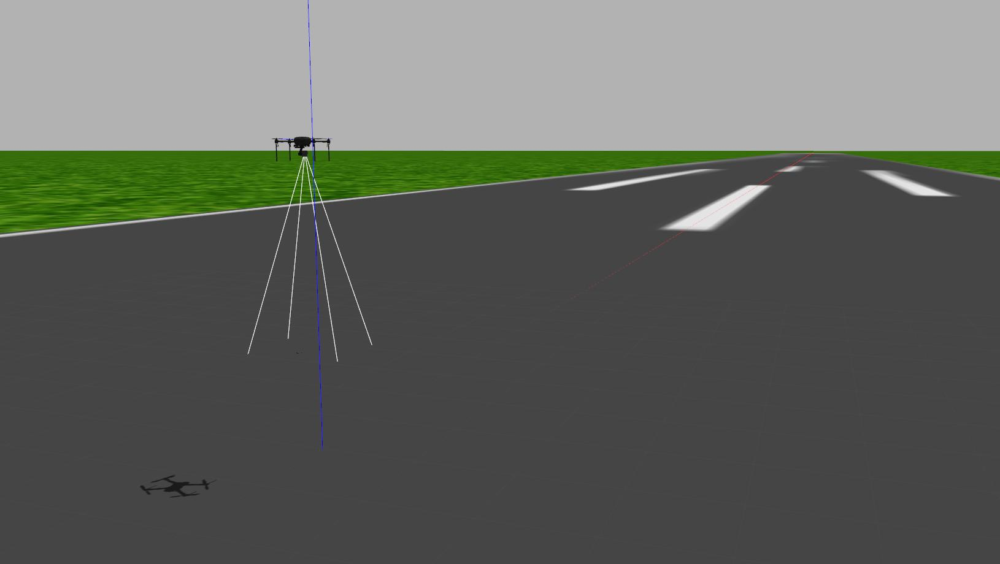

## Dependencies 

Take a look at these tutorials to setup ardupilot, gazebo and the ardupilot gazebo plugin 

[Installing Ardupilot and MAVProxy](https://github.com/Intelligent-Quads/iq_tutorials/blob/master/docs/Installing_Ardupilot.md)

[Installing Gazebo and ArduPilot Plugin](https://github.com/Intelligent-Quads/iq_tutorials/blob/master/docs/installing_gazebo_arduplugin.md)

Installing x-term is recommended as it allows the ardupilot sitl interface to run in a terminal that will cleanly close when closing you sitl instance
```
sudo apt install xterm
```

## Drone Simulations 



This repo contains a couple different gazebo worlds containing various ardupilot drone configurations. The worlds are listed below

- `droneOnly.world` - simple gazebo world containing only a single drone
- `runway.world` - simple gazebo world containing only a single drone on a runway
- `lidar.world` - a simple gazebo world containing a single drone with a 2d lidar sensor
- `multi_drone.world` - a simple world containing 12 drones  

### Running Drone Simulations 

Each world contains a corresponding launch file. For example to launch `runway.world` run
```
roslaunch iq_sim runway.launch
``` 
Launch the ardupilot instance by running 
```
cd ~/ardupilot/ArduCopter/ && sim_vehicle.py -v ArduCopter -f gazebo-iris --console
``` 


